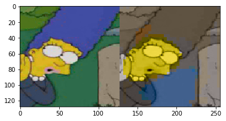
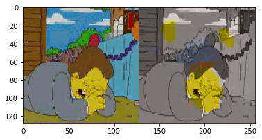
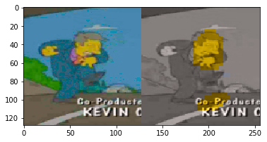
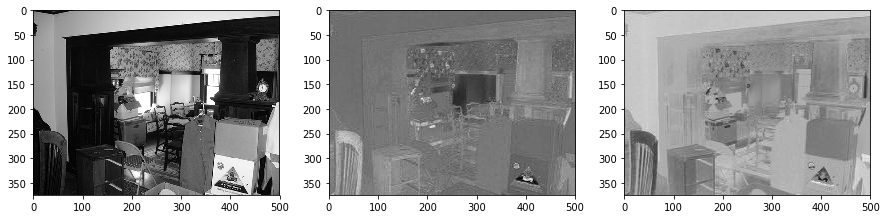
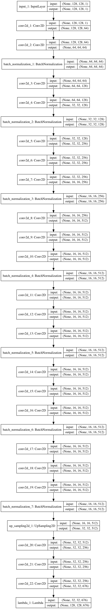

# Colorization

**The Implementation in this project is Not Exactly Go According with Algorithm in Paper, please take this just as a reference.**

## Motivation

My father is a photographer and he is obsessed with anything related with color. When he meets neural network, the cross corner is no doubt colorization. I did a lot of paper survey and make this trial project.(老爸是个摄影师，喜欢色彩，于是我做了这个项目)

## Reference

- Colorful Image Colorization, Richard Zhang, Phillip Isola, Alexei A. Efros
- https://github.com/shekkizh/Colorization.tensorflow by Sarath Shekkizhar
- Simpson Dataset by Alexandre Attia

## Result

> with very limited dataset and training epochs.

## Implementation

### LAB

An image can be encoded with LAB format, like below. Colorization could be treated as a problem with given gray image(L layer), predict 2 other layer.

### Network

### Others

- Try multi-threading generator, it works. But generator in keras framework already works parallel.

